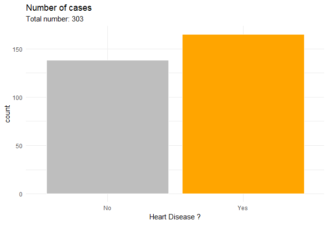

Індивідульне завдання. Аналіз зв'язку медичних показників люини та виникнення хвороби серця
================

Набір даних
-----------

У завданні було використано набір даних, що містить список медичних показнків та алсастивість, що характеризує наявність хвороби серця від UCI Health.(<https://www.kaggle.com/ronitf/heart-disease-uci>)

Набір даних містить наступні атрибути:

1.  age - вік (у роках)
2.  sex - стать (1 - чоловіча, 0 - жіноча)
3.  cp - тип болю в грудях (4 значення: 0,1,2,3)
4.  trestbps - кров'яний тиск у спокої (в мм рт.ст. при надходженні до лікарні)
5.  chol - холесторал сироватки в мг/дл
6.  fbs - цукор крові &gt; 120 мг/дл (1 - так, 0 - ні)
7.  restecg - електрокардіографічні результати спокою (3 значення: 0, 1, 2)
8.  thalach - максимально досягнута частота серцевих скорочень
9.  exang - стенокардія, індукована фізичними вправами (1 - так, 0 - ні)
10. oldpeak - депресія сегменту ST, викликана вправою відносно спокою
11. slope - нахил піку тренування сегмента ST
12. ca - кількість великих судин (0-3), пофарбованих флуороскопією
13. thal - 3 - нормальний; 6 - фіксований дефект; 7 - оборотний дефект
14. target - показник наявності хворби (1 - так, 0 - ні)

Аналіз може допомогти у кращому розумінні про те, які показники у більшій мірі впливають на виникнення хвороби серця.

Хід роботи
----------

``` r
library(dplyr)
library(tidyverse)
library(cowplot)
library(ggridges)
library(ggalluvial)
library(corrplot)
```

### 1. Зчитування та підгтовка вхідних даних

**1.1.** Зчитуємо файл формату csv та подиимось на кількість записів містять дані.

``` r
data <- read.csv('heart-disease-uci/heart_data.csv')

writeLines(sprintf('Number of rows in dataframe : %d', nrow(data)))
```

    ## Number of rows in dataframe : 303

**1.2.** Подивимось на підсумкові результати різних властивостей даних та перевіримо дані на невідомі дані.

``` r
summary(data)
```

    ##       age             sex               cp           trestbps    
    ##  Min.   :29.00   Min.   :0.0000   Min.   :0.000   Min.   : 94.0  
    ##  1st Qu.:47.50   1st Qu.:0.0000   1st Qu.:0.000   1st Qu.:120.0  
    ##  Median :55.00   Median :1.0000   Median :1.000   Median :130.0  
    ##  Mean   :54.37   Mean   :0.6832   Mean   :0.967   Mean   :131.6  
    ##  3rd Qu.:61.00   3rd Qu.:1.0000   3rd Qu.:2.000   3rd Qu.:140.0  
    ##  Max.   :77.00   Max.   :1.0000   Max.   :3.000   Max.   :200.0  
    ##       chol            fbs            restecg          thalach     
    ##  Min.   :126.0   Min.   :0.0000   Min.   :0.0000   Min.   : 71.0  
    ##  1st Qu.:211.0   1st Qu.:0.0000   1st Qu.:0.0000   1st Qu.:133.5  
    ##  Median :240.0   Median :0.0000   Median :1.0000   Median :153.0  
    ##  Mean   :246.3   Mean   :0.1485   Mean   :0.5281   Mean   :149.6  
    ##  3rd Qu.:274.5   3rd Qu.:0.0000   3rd Qu.:1.0000   3rd Qu.:166.0  
    ##  Max.   :564.0   Max.   :1.0000   Max.   :2.0000   Max.   :202.0  
    ##      exang           oldpeak         slope             ca        
    ##  Min.   :0.0000   Min.   :0.00   Min.   :0.000   Min.   :0.0000  
    ##  1st Qu.:0.0000   1st Qu.:0.00   1st Qu.:1.000   1st Qu.:0.0000  
    ##  Median :0.0000   Median :0.80   Median :1.000   Median :0.0000  
    ##  Mean   :0.3267   Mean   :1.04   Mean   :1.399   Mean   :0.7294  
    ##  3rd Qu.:1.0000   3rd Qu.:1.60   3rd Qu.:2.000   3rd Qu.:1.0000  
    ##  Max.   :1.0000   Max.   :6.20   Max.   :2.000   Max.   :4.0000  
    ##       thal           target      
    ##  Min.   :0.000   Min.   :0.0000  
    ##  1st Qu.:2.000   1st Qu.:0.0000  
    ##  Median :2.000   Median :1.0000  
    ##  Mean   :2.314   Mean   :0.5446  
    ##  3rd Qu.:3.000   3rd Qu.:1.0000  
    ##  Max.   :3.000   Max.   :1.0000

``` r
writeLines(sprintf('Number of NAs in dataframe : %d', sum(is.na(df))))
```

    ## Number of NAs in dataframe : 0

Бачимо, що немає даних із невідомими значеннями (NA).

**1.3.** Додамо нові поля до набору даних, щоб визначити деякі фактори для позначення властивостей даних.

``` r
df <- mutate(data,
       sex_fct = factor(sex,levels=c(0,1),labels=c('Female','Male'))
       ,cp=factor(cp)
       ,fbs_fct = factor(fbs,levels=c(0,1),labels=c('FBS <= 120','FBS > 120'))
       ,restecg = factor(restecg)
       ,exang_fct = factor(exang,levels=c(0,1),labels=c('No exercise induced angina','Exercise induced angina'))
       ,slope = factor(slope)
       ,ca = factor(ca)
       ,thal = factor(thal,levels=c(0,1,2,3),labels=c('No','Normal','Fixed defect','Reversable defect'))
       ,target = factor(target,levels=c(0,1),labels=c('No','Yes')))
```

**1.4.** Подиивимось на зразки даних.

``` r
head(df, 5)
```

    ##   age sex cp trestbps chol fbs restecg thalach exang oldpeak slope ca
    ## 1  63   1  3      145  233   1       0     150     0     2.3     0  0
    ## 2  37   1  2      130  250   0       1     187     0     3.5     0  0
    ## 3  41   0  1      130  204   0       0     172     0     1.4     2  0
    ## 4  56   1  1      120  236   0       1     178     0     0.8     2  0
    ## 5  57   0  0      120  354   0       1     163     1     0.6     2  0
    ##           thal target sex_fct    fbs_fct                  exang_fct
    ## 1       Normal    Yes    Male  FBS > 120 No exercise induced angina
    ## 2 Fixed defect    Yes    Male FBS <= 120 No exercise induced angina
    ## 3 Fixed defect    Yes  Female FBS <= 120 No exercise induced angina
    ## 4 Fixed defect    Yes    Male FBS <= 120 No exercise induced angina
    ## 5 Fixed defect    Yes  Female FBS <= 120    Exercise induced angina

``` r
tail(df, 5)
```

    ##     age sex cp trestbps chol fbs restecg thalach exang oldpeak slope ca
    ## 299  57   0  0      140  241   0       1     123     1     0.2     1  0
    ## 300  45   1  3      110  264   0       1     132     0     1.2     1  0
    ## 301  68   1  0      144  193   1       1     141     0     3.4     1  2
    ## 302  57   1  0      130  131   0       1     115     1     1.2     1  1
    ## 303  57   0  1      130  236   0       0     174     0     0.0     1  1
    ##                  thal target sex_fct    fbs_fct                  exang_fct
    ## 299 Reversable defect     No  Female FBS <= 120    Exercise induced angina
    ## 300 Reversable defect     No    Male FBS <= 120 No exercise induced angina
    ## 301 Reversable defect     No    Male  FBS > 120 No exercise induced angina
    ## 302 Reversable defect     No    Male FBS <= 120    Exercise induced angina
    ## 303      Fixed defect     No  Female FBS <= 120 No exercise induced angina

### 2. Візуалізація і дослідження даних

``` r
library(repr)
options(repr.plot.width=4, repr.plot.height = 5)
trgcolors<-c("grey","orange")
cpt<-''

n<-nrow(df)

ggplot(df,aes(target, fill=target)) +
  geom_bar(stat="count", color='white') +
  theme_minimal()  +
  scale_fill_manual(values=trgcolors)+
  labs(title='Number of cases', 
       subtitle=sprintf('Total number: %d',n),
       x='Heart Disease ?',caption=cpt)+
  guides(fill=FALSE)
```



**2.1.** Безперервні змінні

Опишемо безперервні змінні та розгянемо їх розподіли, порівнюючи дві групи: з хворобою серця і без нього.

``` r
chrtCntDens <- function(dfa,x='age',y='target',xlabel='age',legendtitle='legend'){
  lbls<-levels(dfa[,y])  
  ggplot(df, aes_string(x = x, y = '..count..')) +
    geom_density_line(data = select(dfa,c(x)), aes(fill = "all"), color=NA) +
    geom_density_line(aes_string(fill = y), color='white') +
    scale_fill_manual(
      values = c('#b3b3b34a',trgcolors),
      breaks = c(lbls,'all'),
      labels = c(lbls,'All'),
      name = legendtitle,
      guide = guide_legend(direction = "horizontal")) +
    facet_wrap(c(y),ncol=2)+
    theme_minimal() + theme(legend.position='top',legend.justification = 'left')+
    labs(title=sprintf('Density of %s',xlabel)
         , x=sprintf('%s',xlabel), y= 'count',caption=cpt)
}

lngdttl<-'Heart Disease?'
options(repr.plot.width=10, repr.plot.height = 5)
plot_grid(
    chrtCntDens(df,x='age',y='target',xlabel='age',legendtitle = lngdttl)
    ,chrtCntDens(df,x='trestbps',y='target',xlabel='Resting Blood Pressure',legendtitle = lngdttl))
```


Серцево-судинні захворювання виявляються найсильнішими у віковому діапазоні від 40 до 55 років. У діаграмі кров'яного тиску під час спокою розподіли більш схожі, однак розподіл захворювання крутіше, концентруючись приблизно на 140.

``` r
options(repr.plot.width=10, repr.plot.height = 5)
plot_grid(
chrtCntDens(df,x='chol',y='target',xlabel='Serum Cholestoral in mg/dl',legendtitle = lngdttl)
,chrtCntDens(df,x='thalach',y='target',xlabel='Maximum Heart Rate archieved',legendtitle = lngdttl))
```


Для максимально досягнеої частоти серцевих скорочень зрозуміло, що у пацієнтів із серцевими захворюваннями досить високі показники. Для холесторалу сироватки різниця між групами менше, однак група захворювань має більш низькі значення.

``` r
options(repr.plot.width=5, repr.plot.height = 5)
chrtCntDens(df,x='oldpeak',y='target',xlabel='ST Depression induced by exercise relative to rest',legendtitle = lngdttl)
```


Для депресії сегменту ST, викликаною вправою відносно спокою група захворювань має більш низькі значення.

**2.2.** Категоріальні змінні

Опишемо категоріальні змінні та розгянемо їх внескидо двох різних груп пацієнтів: з хворобою серця і без нього.

``` r
chrtAlluvium<-function(dfa,x='sex',y='target',xlabel='',ylabel='',title='') {
  freqcat<-dfa %>% group_by_at(c(x,y)) %>% summarise(n = n())
  ggplot(freqcat,aes_string(y = 'n', axis1 = x, axis2 = y)) +
    geom_alluvium(aes_string(fill = y), width = 1/2, alpha=0.8, color='white',size=.3) +
    geom_stratum(width = 1/12,color='grey50',fill=NA,size=.2) +
    geom_text(stat = "stratum", label.strata = TRUE, angle=90,color='white',size=3) +
    scale_x_discrete(limits = c(xlabel, ylabel), expand = c(.05, .05)) +
    scale_fill_manual(values=trgcolors)+
    theme_minimal() + theme(legend.position='none',legend.justification = 'left')+
    labs(title=sprintf(title,xlabel)
         , y= 'count',fill=ylabel
         ,caption=cpt)  
}

options(repr.plot.width=10, repr.plot.height = 3)


ttl<-'Heart Disease by %s'

plot_grid(
   chrtAlluvium(df,x='sex_fct',y='target',xlabel='Sex',ylabel=lngdttl,title=ttl)
    ,chrtAlluvium(df,x='cp',y='target',xlabel='Chess Pain',ylabel=lngdttl,title=ttl))
```


Виявляеться, що більше жінок мають хвороба, і чим вище біль у грудях, тим вищий шанс на серцеві захворювання.

``` r
options(repr.plot.width=5, repr.plot.height = 5)
chrtCntDens(df,x='oldpeak',y='target',xlabel='ST Depression induced by exercise relative to rest',legendtitle = lngdttl)
```


Для цукру в крові пропорційність відповідності резльтцючому значенню для двох категорій даних дуже схожа. Для ЕКГ у стані спокою значення 1 має більшу кількість пацієнтів із серцевими захворюваннями.

``` r
options(repr.plot.width=10, repr.plot.height = 5)
plot_grid(
    chrtAlluvium(df,x='exang_fct',y='target',xlabel='Exercise Induced Angina',ylabel=lngdttl,title=ttl)
    ,chrtAlluvium(df,x='slope',y='target',xlabel='Slope Peak exercise ST',ylabel=lngdttl,title=ttl)
)
```


Індикатор захворювання серця проявляється найбільше при відсутності стенокардії, викликаною фізичними вправами. Для нахилу піку тренування сегмента ST високе значення призводить, в основному, до ознаки захворювання.

``` r
plot_grid(
    chrtAlluvium(df,x='thal',y='target',xlabel='Thalassemia',ylabel=lngdttl,title=ttl)
    ,chrtAlluvium(df,x='ca',y='target',xlabel='Number of Major Vessels',ylabel=lngdttl,title=ttl)
)
```


Низький бал за кількість великих судин свідчить про більш високий шанс на захворювання серця. Для таласемії є фіксований дефект є сильним показанням.

**2.3.** Кореляція між показниками

Для числових змінних можна побудувати кореляційний графік, виявляється, що всі вони знаходяться нижче | 0.4 |

``` r
data <-select(df,-ends_with('_fct'))
options(repr.plot.width=5, repr.plot.height = 5)
corrplot(cor(select_if(data, is.numeric ))
         , method="color", type='lower',order = "hclust",diag = FALSE
         ,addCoef.col = "grey20"
         ,tl.col = "grey20", tl.srt = 90)
```


